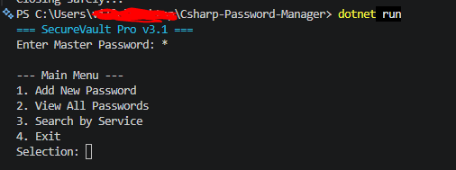
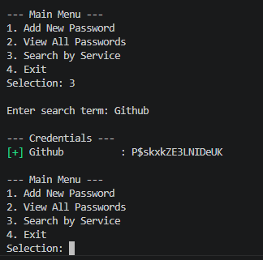
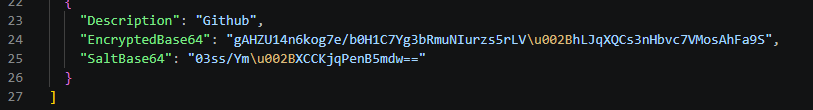
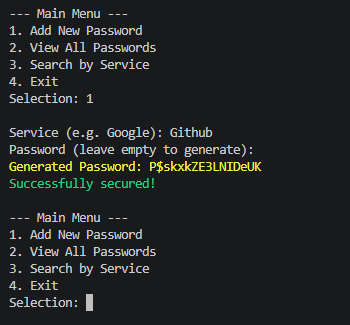

# SecureVault Pro

SecureVault Pro is a high-security, console-based password management solution built with C# and .NET 9. The project focuses on professional-grade cryptographic standards and a decoupled software architecture, ensuring that sensitive information remains protected even if the physical storage file is compromised.

The application serves as a demonstration of modern .NET development practices, emphasizing data security, clean code, and asynchronous resource management.

## Technical Architecture
```mermaid

graph TD
    A[User Interface - CLI] -->|Master Password| B(Encryption Service - AES 256)
    B -->|Encrypted Data| C[Data Repository - JSON]
    C -->|Write/Read| D[(passwords.json)]
    
    style A fill:#0078d4,stroke:#fff,color:#fff
    style B fill:#00bc27,stroke:#fff,color:#fff
    style C fill:#68217a,stroke:#fff,color:#fff
    style D fill:#f2c811,stroke:#000,color:#000
    ` ` `
The system is built using a layered approach to ensure maintainability and strict separation of concerns:

* **Core Layer:** Defines the essential interfaces (`IEncryptionService`, `IPasswordRepository`) and data models.
* **Security Service:** Implements AES-256 encryption and PBKDF2 key derivation.
* **Data Access:** Handles asynchronous JSON serialization and local file persistence.
* **Presentation:** A CLI-based interface with secure input masking and visual feedback.


## Security Implementation

### Encryption Standards
* **AES-256-CBC:** Industry-standard encryption using 256-bit keys in Cipher Block Chaining mode.
* **Unique Salting:** A cryptographically random 128-bit salt is generated for every entry, preventing rainbow table attacks.
* **Key Stretching:** Implements PBKDF2 with 600,000 iterations of SHA-256 to derive encryption keys from master passwords, significantly increasing brute-force resistance.

### Data Protection
The master password is never stored on the disk. It exists only in memory during the session to derive temporary encryption keys. If the storage file is accessed externally, the content remains computationally infeasible to decrypt without the master key.



## Usage Guide

### 1. Initialization
Upon launching, the application requires a Master Password. This password acts as the primary key for all cryptographic operations in the current session.

### 2. Operational Menu
* **Option 1: Add New Password** – Allows the user to store credentials for a new service. If the password field is left empty, the system triggers an automatic generator to create a high-entropy, 16-character string.

* **Option 2: List All Passwords** – Decrypts and displays all stored credentials. This view provides immediate feedback on whether the current Master Password is correct.
* **Option 3: Search by Service** – Enables quick filtering of the database. Users can find specific credentials by entering a partial or full service name.
* **Option 4: Exit Safely** – Clears session data and terminates the process.


## Getting Started

### Prerequisites
* .NET 9.0 SDK

### Installation and Execution
1. Clone the repository:
   git clone https://github.com/williamis/Csharp-Password-Manager.git
Navigate to the project directory:

cd Csharp-Password-Manager
Run the application:
dotnet run